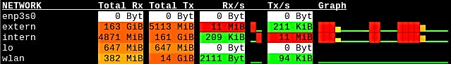

# cl-netstat

Curses Program which visualizes network traffic by reading ```/proc/net/dev```.

## Dependencies

- [croatoan](https://github.com/McParen/croatoan) (Available through [Quicklisp](https://www.quicklisp.org/beta/))

## Compability

Only tested with [sbcl](https://www.sbcl.org/) on Linux.

## Installation

Just clone it into ```quicklisp/local-project``` and run ```(ql:quickload :cl-netstat)```

## Build

```commonlisp
(asdf:make :cl-netstat)
```

## Run

Since this is a curses program one has to run it inside a
terminal. You can either start up sbcl, load cl-netstat and then call
```(cl-netstat:main)``` or build an executable via
```(asdf:make :cl-netstat)``` and run that.  When using the executable
see ```-h``` for configuration options.

The terminal used has to be able to display more than the 8 basic colors,
for example TERM=xterm-256color

## Keybindings

| Key   | Usage                         |
|------:|-------------------------------|
| q     | Quit                          |
| +     | Increase refresh timeout      |
| -     | Decrease refresh timeout      |
| r     | Reset screen                  |
| c     | Clear screen                  |
| Space | Print current refresh timeout |


## Screenshot



